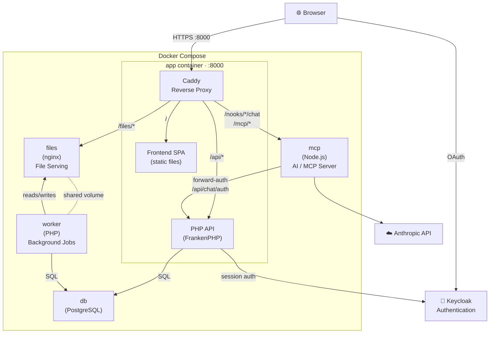

# Architecture

This document describes the service architecture of Paith Notes.

## Container Overview



## Responsibilities

| Service      | Image                | Role                                                                                                                                                                                                 |
|--------------|----------------------|------------------------------------------------------------------------------------------------------------------------------------------------------------------------------------------------------|
| **app**      | `ghcr.io/.../app`    | FrankenPHP container: serves the compiled frontend SPA and handles all `/api/*` requests via PHP. Acts as the central reverse proxy routing traffic to `files` and `mcp`.                            |
| **mcp**      | `ghcr.io/.../mcp`    | Optional Node.js service. Provides the in-app AI chat and an MCP endpoint for external AI tool clients. Authenticates via Keycloak JWT (MCP) or by forwarding session cookies to the PHP API (chat). |
| **worker**   | `ghcr.io/.../worker` | PHP background worker. Processes queued jobs — file finalization, S3 uploads, link indexing. Shares the `files_data` volume with the `files` service.                                                |
| **files**    | `nginx`              | Serves uploaded files directly from the `files_data` volume. Kept separate so file serving never blocks PHP workers.                                                                                 |
| **db**       | `postgres:17`        | PostgreSQL database. All application state lives here.                                                                                                                                               |
| **Keycloak** | external             | Authentication provider. Not managed by this repo — deployed separately.                                                                                                                             |

## Request Flow

### Normal page / API request

```
Browser → app (Caddy) → PHP API → PostgreSQL
                      ↘ nginx (files)
```

### AI chat request

```
Browser → app (Caddy) → mcp (Node.js)
                            ↓ forward-auth
                          app (PHP) → verifies session → PostgreSQL
                            ↓ approved
                          Anthropic API
                            ↓ tool calls (with user approval)
                          app (PHP API)
```

### MCP external client (e.g. Claude Desktop, Cursor)

```
MCP Client → app (Caddy) → mcp (Node.js)
                                ↓ validates Keycloak JWT
                              app (PHP API) → PostgreSQL
```

## Production vs Development

| Aspect    | Development                                        | Production                               |
|-----------|----------------------------------------------------|------------------------------------------|
| Frontend  | Vite dev server (`frontend` container, hot reload) | Built into `app` image (`/srv/frontend`) |
| Caddyfile | `Caddyfile` (proxies to Vite)                      | `Caddyfile.prod` (serves static files)   |
| PHP       | Live code mount + FrankenPHP watch mode            | Compiled into `app` image                |
| MCP       | Live source mount + `tsx --watch`                  | Built TypeScript in `mcp` image          |
| Auth      | `DEBUG_AUTH=1` optional (bypass Keycloak)          | Keycloak required                        |

## Data Storage

All persistent data lives in two places:

- **PostgreSQL** (`db`) — all structured data: users, nooks, notes, types, links, conversations, jobs
- **`files_data` volume** — uploaded files, temporary upload staging area

The `files_data` volume is shared between `worker` (writes) and `files` (reads/serves).

## AI Isolation

The `mcp` service is architecturally isolated from the core application:

- It is a separate container with no shared code or volumes
- The core `app` has no runtime dependency on `mcp`
- If `mcp` is not running, all non-AI features continue to work normally
- `mcp` can only reach the outside world via the PHP API (using the authenticated user's session) and the Anthropic API
- It has no direct database access
